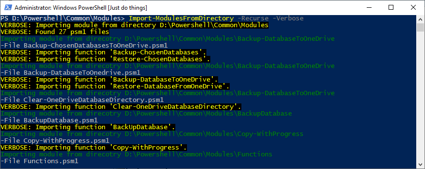

<!--Category:Powershell--> 
 <p align="right">
    <a href="https://www.powershellgallery.com/packages/ProductivityTools.PSImportModulesFromDirectory/"></a>
    <a href="http://www.productivitytools.tech/sql-commands/"><a> 
    <a href="https://github.com/pwujczyk/ProductivityTools.PSImportModulesFromDirectory"></a>
</p>
<p align="center">
    <a href="http://productivitytools.tech/">
        
    </a>
</p>


# Import-ModulesFromDirectory

Imports all modules from the given directory.
<!--more-->


Not all modules written by me are pushed directly to the powershellgallery.com. At first, usually, I am storing them locally and use for some time. Some of them won't be published as they are very specific to my needs and won't be valuable for others.

To import them in the convenient way I am using an Import-ModulesFromDirectory module. 

It searches through the directory to find psm1 files and performs **Import-Module** on them.
<!--og-image-->


```powershell
Import-ModulesFromDirectory -Recurse -Verbose

Import-ModulesFromDirectory -Recurse -Verbose -Path D:\Powershell\Common\Modules\
```

Cmdlet has two switches: **Recuse** and **Path**. If **Path** is not provided it uses the current directory.
